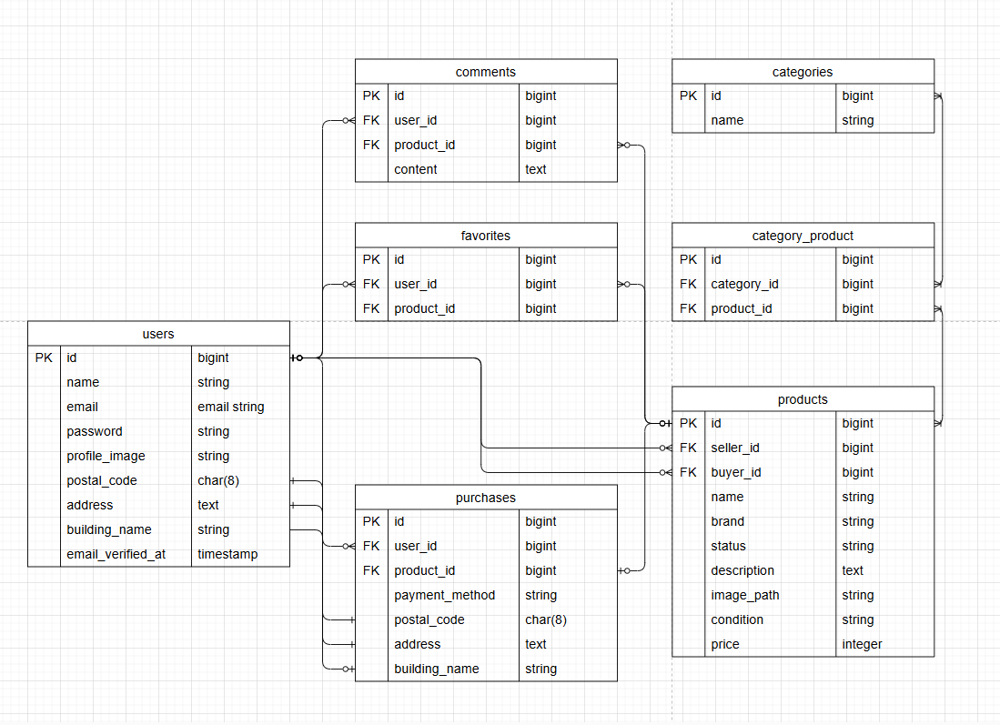

# 模擬案件1
Laravelによる商品出品・購入・コメント・お気に入り・メール認証機能を備えた模擬ECアプリケーションです。

## 環境構築手順
プロジェクト直下に.envを作成
touch .env

.envに以下を記述（UID/GIDはホストOSのユーザーIDに合わせて設定）
UID=1000
GID=1000

Docker ビルド 
docker-compose up -d --build

## コンテナ操作
PHPコンテナに入る 
docker-compose exec php bash

Composer インストール 
composer install

## Laravel初期設定
.env 作成 
cp .env.example .env

アプリキー生成 
php artisan key:generate

シンボリックリンク作成
php artisan storage:link

マイグレーション
php artisan migrate

ダミーデータ作成
php artisan db:seed

## Stripeの設定
Stripeのテストキーを `.env` に記述してください（`.env.example` にも記載済みです）

## テストケース確認コマンド
全テスト：php artisan test
ID1「会員登録機能」：php artisan test tests/Feature/RegisterTest.php
ID2「ログイン機能」：php artisan test tests/Feature/LoginTest.php
ID3「ログアウト機能」: php artisan test tests/Feature/LoginTest.php
ID4「商品一覧取得」：php artisan test tests/Feature/ProductIndexTest.php
ID5「マイリスト一覧取得」：php artisan test tests/Feature/MyListIndexTest.php
ID6「商品検索機能」: php artisan test tests/Feature/ProductSearchTest.php
ID7「商品詳細情報取得」: php artisan test tests/Feature/ProductShowTest.php
ID8「いいね機能」：php artisan test tests/Feature/ProductFavoriteTest.php
ID9「コメント送信機能」： php artisan test tests/Feature/ProductCommentTest.php
ID10「商品購入機能」： php artisan test tests/Feature/PurchaseTest.php
ID11「支払い方法選択機能」：php artisan test tests/Feature/PurchaseTest.php
ID12「配送先変更機能」： php artisan test tests/Feature/PurchaseTest.php
ID13「ユーザー情報取得」： php artisan test tests/Feature/ProfileTest.php
ID14「ユーザー情報変更」： php artisan test tests/Feature/PurchaseTest.php
ID15「出品商品情報登録」： php artisan test tests/Feature/ExhibitionTest.php
ID16「メール認証機能」： php artisan test tests/Feature/EmailVerificationTest.php

PHPコンテナから出る　Ctrl+D

## ダミーデータ仕様

ダミーデータユーザー情報（3名）
name:kiwi
email:kiwi@example.com
password:password
出品数:5
購入数:0
お気に入り:全商品
コメント:1(マイク)
メール認証済み

name:orange
email:orange@example.com
password:password
出品数:5
購入数:1(腕時計)
お気に入り:5(自身が出品した商品を除く全て)
コメント:1(ノートPC)
メール未認証

name:watermelon
email:watermelon@example.com
password:password
出品数:0
購入数:0
お気に入り:全商品
コメント:1(腕時計)
メール未認証
住所未登録

## 補足（ユーザー仕様関連）
- 新規登録ユーザーは、自身が出品した商品に対して「お気に入り」「コメント」機能を利用できません。
- テストケースの検証意図：
  - ID4：自分が出品した商品は一覧に表示されないことを確認
  - ID5：いいねした商品だけが一覧に表示されることを確認
- この検証のため、ユーザー「kiwi」には例外的に **自身が出品した商品にお気に入りステータスを付与**しています。

## 主なルート一覧
本プロジェクトのルート構成（URL・メソッド・ミドルウェア）は、別途提出するスプレッドシートに記載しています。  
レビュー担当者はそちらをご参照ください。

## 動作確認URL一覧
ログイン画面表示:http://localhost/login
商品一覧画面：http://localhost
MySQL画面：http://localhost:8080
mailhog認証画面：http://localhost:8025/

### MailHogのメール認証手順
1. 新規ユーザー登録を行う
2. メール認証誘導画面に遷移、「認証はこちらから」のボタンをクリック
3. 以下のURLから MailHog にアクセスするので、メール内容を確認してください  
   👉 [http://localhost:8025]
4. 自身が登録したメール本文内の「メールアドレスを確認する」または「Verify Email Address」をクリックすると、認証が完了し、初回はプロフィール設定画面に遷移します
※MailHogで認証リンクをクリックした際、1回目は反応しない場合があります。
その際は一覧画面に戻り、再度リンクをクリックしてください。

### stripeのテスト
1. 購入画面でクレジットを選択し購入ボタンをクリックする
2. カード番号4242 4242 4242 4242を入力、MM(月)/YY(年)・セキュリティコードは適当な3桁の数字を入力
3. 名前は適当な名前を入力
4. 支払うボタンをクリックする
## 補足（Stripe関連）
StripeのCheckout画面では、カード番号以外の入力値（名前・メールアドレスなど）はサンドボックス環境ではバリデーションされません。 Laravel側で事前にユーザー情報や商品状態を確認し、購入完了後にDBへ記録することで、整合性を担保しています。

### バリデーション仕様の補足
- 商品画像は **JPEG/PNG形式、2MB以内** に制限しています。
- ファイル形式が異なる場合は Laravel のバリデーションでエラーメッセージが表示されます。
- ただし、サイズが大きすぎる場合は **nginx が先にリクエストを拒否**するため、
  ブラウザ上で「413 Request Entity Too Large」エラーが表示されることがあります。

仕様環境
PHP: 8.1.33 (CLI/FPM)
Laravel Framework: 8.83.8 (LTS)
MySQL: 8.0.26
nginx: 1.21.1
MailHog

ER図

## 補足（環境関連）
- MailHogはローカル開発用のSMTPキャプチャツールです。メールは実際には送信されません。
- UID/GIDはLinux環境で `id` コマンドにより確認可能です。
- ER図は設計の参考用です。実装と完全一致しない場合があります。
